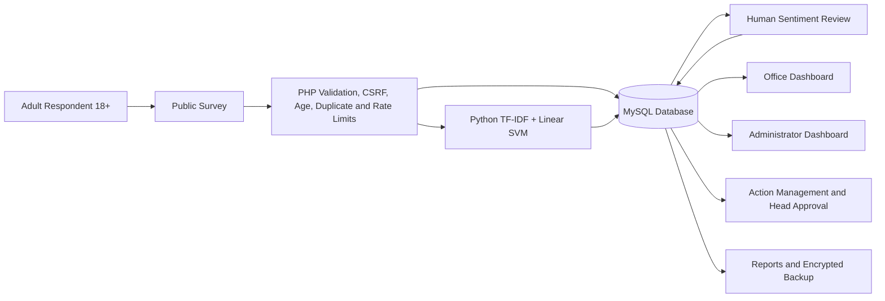
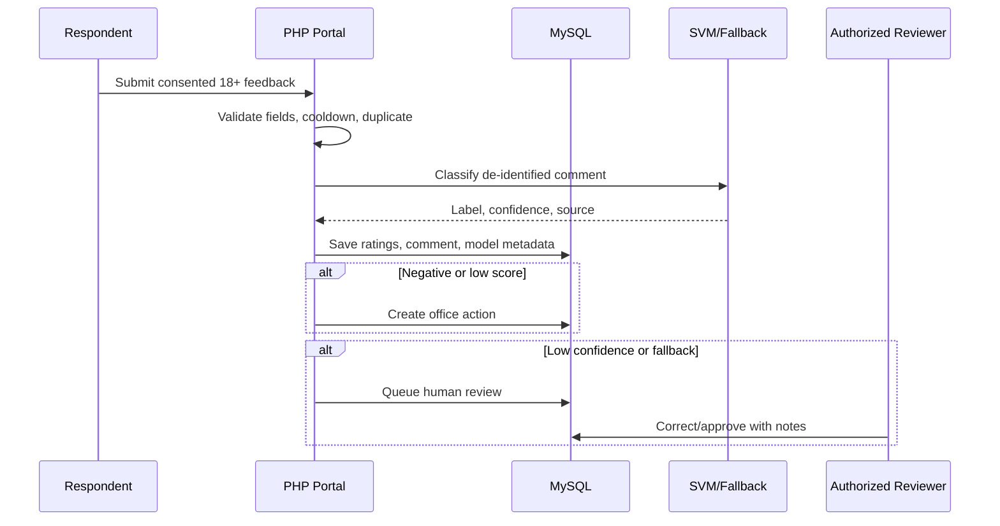
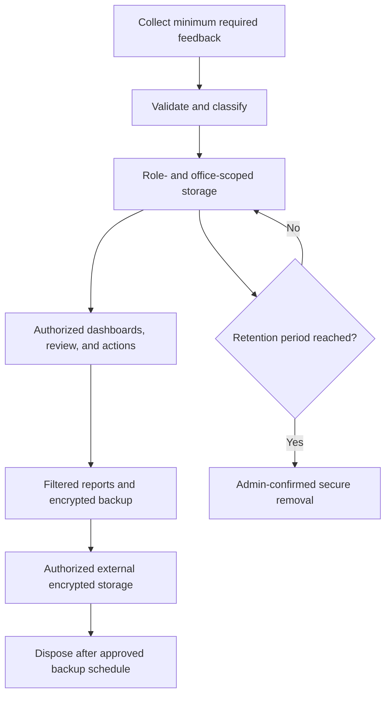

# Defense Diagrams

## System architecture

```mermaid
flowchart LR
    R[Adult Respondent 18+] --> S[Public Survey]
    S --> V[PHP Validation, CSRF, Age, Duplicate and Rate Limits]
    V --> DB[(MySQL Database)]
    V --> ML[Python TF-IDF + Linear SVM]
    ML --> DB
    DB --> HR[Human Sentiment Review]
    DB --> OD[Office Dashboard]
    DB --> AD[Administrator Dashboard]
    HR --> DB
    DB --> AM[Action Management and Head Approval]
    DB --> RP[Reports and Encrypted Backup]
```

## Feedback processing sequence

```mermaid
sequenceDiagram
    participant R as Respondent
    participant P as PHP Portal
    participant D as MySQL
    participant M as SVM/Fallback
    participant H as Authorized Reviewer
    R->>P: Submit consented 18+ feedback
    P->>P: Validate fields, cooldown, duplicate
    P->>M: Classify de-identified comment
    M-->>P: Label, confidence, source
    P->>D: Save ratings, comment, model metadata
    alt Negative or low score
        P->>D: Create office action
    end
    alt Low confidence or fallback
        P->>D: Queue human review
        H->>D: Correct/approve with notes
    end
```

## Data lifecycle

```mermaid
flowchart TD
    C[Collect minimum required feedback] --> P[Validate and classify]
    P --> S[Role- and office-scoped storage]
    S --> U[Authorized dashboards, review, and actions]
    U --> E[Filtered reports and encrypted backup]
    S --> R{Retention period reached?}
    R -- No --> S
    R -- Yes --> D[Admin-confirmed secure removal]
    E --> B[Authorized external encrypted storage]
    B --> X[Dispose after approved backup schedule]
```

## SVM research workflow

```mermaid
flowchart LR
    A[Approved de-identified comments] --> L[Two independent labelers]
    L --> K[Cohen's Kappa]
    K --> Q[Resolve disagreements]
    Q --> D[Deduplicate and validate]
    D --> T[Development data]
    D --> F[Untouched final test set]
    T --> C[5-fold CV and tuning]
    C --> B[Best LinearSVC]
    B --> F
    F --> M[Accuracy, Precision, Recall, F1, Confusion Matrix]
    M --> H[Human-reviewed production use]
```
